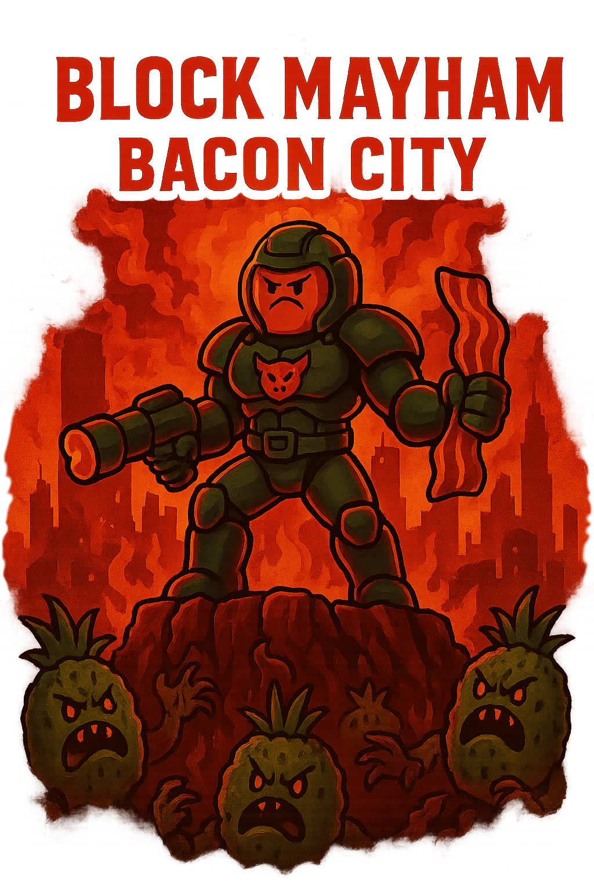

<div align="center"></div>

<div align="center">
<h3>Sequel to the original Block MayHam</h3>
</div>

## Architecture

This project uses a **workspace structure** with separate crates for shared logic, client, and server:

```
├── crates/
│   ├── shared/   # Pure ECS data (components, events, resources)
│   ├── client/   # Full Bevy game with rendering
│   └── server/   # Headless authoritative server
```

### ECS Design Philosophy

- **shared/**: Domain layer - pure game logic with no rendering/input dependencies
- **client/**: Presentation layer - plugins for rendering, input, UI
- **server/**: Authoritative simulation - headless Bevy for multiplayer

## Project Structure

```
├── Cargo.toml              # Virtual workspace
├── assets/                 # Game assets (models, textures, audio)
├── config/                 # Runtime config files (RON format)
│   ├── keybinds.ron
│   ├── gameplay.ron
│   ├── audio.ron
│   └── video.ron
├── locales/                # Translations (Fluent format)
│   └── en-US.ftl
├── crates/
│   ├── shared/
│   │   └── src/
│   │       ├── components/  # Player, Weapon, Health, Team
│   │       ├── events/      # Combat events
│   │       ├── resources/   # Game config
│   │       └── net/         # Network messages
│   ├── client/
│   │   └── src/
│   │       ├── plugins/     # Camera, Input, UI, Physics, etc.
│   │       ├── states/      # Loading, MainMenu, Gameplay, Pause
│   │       └── systems/     # Animation, Networking
│   └── server/
│       └── src/
│           ├── plugins/     # NetServer, Authority, AI, Persistence
│           └── systems/     # Tick, Simulation
├── logs/                   # Runtime logs (gitignored)
└── tests/                  # Integration tests

```

## Getting Started

### Prerequisites

- Rust stable (see `rust-toolchain.toml`)
- Cargo

### Building

```bash
# Build all crates
cargo build --workspace

# Build release
cargo build --workspace --release
```

### Running

```bash
# Run client
cargo run --bin client

# Run server
cargo run --bin server
```

### Development

```bash
# Format code
cargo format

# Check formatting
cargo format-check

# Run lints
cargo lint

# Run all lints
cargo lint-full
```

## Tech Stack

- **Engine**: Bevy 0.17
- **Language**: Rust (Edition 2024)
- **Networking**: UDP via Lightyear (planned)
- **Scripting**: Lua via mlua (planned)
- **Config**: RON (Rusty Object Notation)

## Planned Features

### Core Gameplay
- FPS mechanics (movement, shooting)
- Third-person mode
- Health and weapon systems
- Team-based gameplay

### Multiplayer
- Server-authoritative architecture
- UDP networking
- 8 maps with multiple game modes
- Support for 16 players per match

### Progression
- Player save data
- Level progression system
- Persistent stats

### Cross-Game Features
- Shared backend with Unity sequel and Ursina original
- Lua scripting for weapon configs and game modes
- PostgreSQL + Redis for persistence
- C# backend for matchmaking, auth, and save data

1. **Workspace separation**: Client and server share core logic but have different dependencies
2. **Plugin architecture**: Each gameplay system is isolated (Bevy best practice)
3. **State machines**: Clear game state transitions
4. **Config-driven**: Avoid recompiles for balance tweaks
5. **Server-authoritative**: Anti-cheat and fair gameplay

### Network Architecture

```
Client (Rust/Bevy) <--UDP--> Server (Rust/Bevy)
       |                            |
       +-------WebSocket------------+
       |                            |
       v                            v
    C# Backend (ASP.NET Core)
    - Authentication
    - Matchmaking
    - Save data API
    - Leaderboards
```

## Contributing

(Guidelines coming soon)

## License

Coming soon!

## Roadmap

Coming soon!
